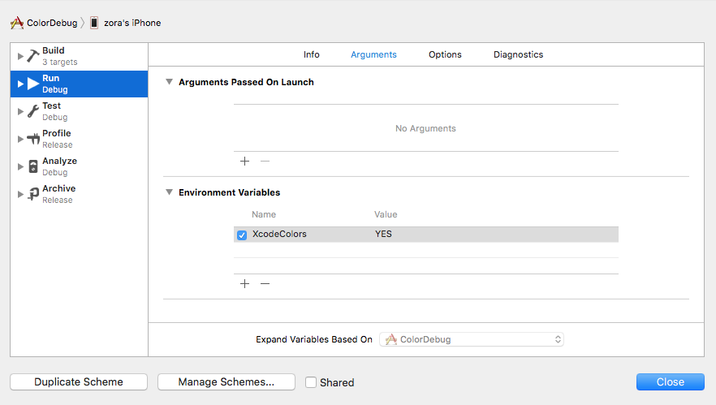

## 基于XcodeColors的ColorLogger

### XcodeColors

XcodeColors是一个Xcode插件，支持对控制台信息进行着色。对于iOS开发调试来说，可以利用这个功能对一些特定模块、重要信息进行着色，提升定位日志的速度。


GitHub地址: [https://github.com/robbiehanson/XcodeColors](https://github.com/robbiehanson/XcodeColors)

下载后，直接运行TestXcodeColors，如果控制台文本能正常打印颜色，重启Xcode，选择Load Bundle，结束。


如果运行TestXcodeColors没有看到上述效果，建议对Xcode自签名或者在plist里写入UUID。


### XcodeColors规则
在终端中通过\033来设置打印文字的背景色和前景色 <font color=#ff0000 size=3>**\033[前景色;背景色m**</font> + <font color=#ff0000 size=3>**字符串**</font> + <font color=#ff0000 size=3>**[0m**</font> ，例如：


而XcodeColors规则类似，<font color=#ff0000 size=3>**\033[fg前景色;**</font> + <font color=#ff0000 size=3>**\033[bg背景色;**</font> + <font color=#ff0000 size=3>**字符串**</font> + <font color=#ff0000 size=3>**\033[**</font>;

```objective-c
#define XcodeRedColorLogExample(fmt, ...) NSLog((@"\033[fg255,0,0;" fmt @"\033[;"), ##__VA_ARGS__)
```


### 使用ColorLogger

ColorLogger是基于XcodeColors将一些包含特定标示的（比如日志level、关键字）的日志按不同的颜色打印。

GitHub地址：[https://github.com/zorajiang/ZJColorLogger](https://github.com/zorajiang/ZJColorLogger)

在Environment Variables中增加XcodeColors。



将.h和.m加入到工程中，使用方法如下。

注意：ColorLogger是在打印到控制台的时候才有效，建议只在Debug模式下使用。

```objective-c
- (BOOL)application:(UIApplication *)application didFinishLaunchingWithOptions:(NSDictionary *)launchOptions {
    // Override point for customization after application launch.
    
    [[ZJColorLogger sharedInstance] setForegroundColor:[UIColor redColor]
                                       backgroundColor:[UIColor whiteColor]
                                               forFlag:ZJColorLogFlagRed];

    ZJColorLog(ZJColorLogFlagError,@"Error - blue color ", __FUNCTION__, __LINE__);
    ZJColorLog(ZJColorLogFlagWarning,@"Warnning - purple color", __FUNCTION__, __LINE__);
    ZJColorLog(ZJColorLogFlagInfo,@"Info - gray color");
    ZJColorLog(ZJColorLogFlagDebug,@"Debug - black color");
    
    ZJColorLog(ZJColorLogFlagRed, @"Red log from  %s : %zd", __FUNCTION__, __LINE__);
    ZJColorLogRed(@"Red log by ZJColorLogRed from  %s : %zd", __FUNCTION__, __LINE__);
    
    return YES;
}
```

控制台输出为：


### 如何自定义Log颜色
- 增加一个ZJColorLogFlag，比如将重要的IAP信息定义为 ZJColorLogFlagIAP 或者  ZJColorLogFlagRed

```objective-c
// 日志类型
typedef NS_OPTIONS(NSUInteger, ZJColorLogFlag)
{
    ZJColorLogFlagError      = (1 << 0), //blue
    ZJColorLogFlagWarning    = (1 << 1), //purple
    ZJColorLogFlagInfo       = (1 << 2), //gray
    ZJColorLogFlagDebug      = (1 << 3), //black

    ZJColorLogFlagRed       = (1 << 4), //red
};
```

- 为该flag的日志设置一个前景色和背景色，如下。

```objective-c
- (BOOL)application:(UIApplication *)application didFinishLaunchingWithOptions:(NSDictionary *)launchOptions {
    // Override point for customization after application launch.
    
    [[ZJColorLogger sharedInstance] setForegroundColor:[UIColor redColor] backgroundColor:[UIColor whiteColor] forFlag:ZJColorLogFlagRed];
	 
	 //	...
    return YES;
}
```

或者在ColorLogger.m中增加一个如下配置。

```objective-c
- (void)loadDefaultColorSettings
{
 	 //	...
    [self setForegroundColor:[UIColor blackColor] backgroundColor:nil forFlag:ZJColorLogFlagDebug];
}
```


- 在需要打印日志的地方调用ZJColorLog(flag, fmt, ...)即可。


```objective-c
- (BOOL)application:(UIApplication *)application didFinishLaunchingWithOptions:(NSDictionary *)launchOptions {
    // Override point for customization after application launch.

    
    ZJColorLog(ZJColorLogFlagRed, @"Red log from  %s : %zd", __FUNCTION__, __LINE__);
    ZJColorLogRed(@"Red log by ZJColorLogRed from  %s : %zd", __FUNCTION__, __LINE__);
    
    return YES;
}
```

为快速使用，建议定义一些常用宏，比如：

```objective-c
#define ZJColorLogRed(fmt, ...)  ZJColorLog(ZJColorLogFlagRed, fmt, ##__VA_ARGS__)
```


